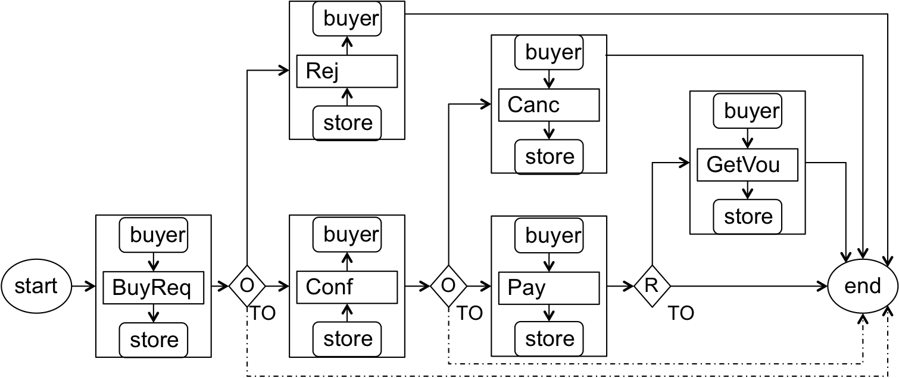
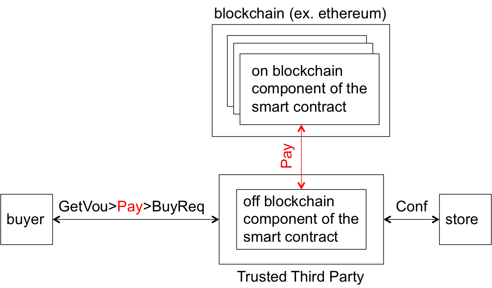

# TECOmate: 

**Tools for the Enforcement of Smart Contracts On-line with MAthematics and TEchnology**.
</br>


The word **tecomate** is pronunced [te.koˈma.te] in Spanish  
and probably [te.koˈmeit] in English and is the name of tree 
that grows in Mexico and Central American countries. 
<p align="center">
  
</p>
</br>

We use **TECOmate** to name our Git repository that hosts the implementation
of an hybrid achitecture for the enforcement of smart contracts. 
Hybrid means that it is composed of on and off blockchain
components. 

**The main idea:** split the clauses of the smart
contract of interest into two sets and enforce them
separately:

* on--blockchain set: enforced by a smart contract running on-blockchain.
* off-blockchain set: enforced by a smart contract running off-blocchain.

The main arguments in support of hybrid architectures are
detailed in 
[On and Off-Blockchain Enforcement Of Smart Contracts](https://arxiv.org/pdf/1805.00626.pdf "position paper")). In summary the argument is that:

* the hybrid approach help in meeting some QoS requirements imposed on
smart contracts that neither on of off blockchain approaches
can meet individually. 
   
* application that involve several
smart contracts running independent on and off blockchain
components will become common practice in the near future. 

## Example of a smart contract
Let us use the following business contract agreed upon
between a buyer and a seller of personal data and 
written in English language.

```
1) The buyer has the right to place a buy request with the 
   store to buy an item.
2) The store has the obligation to respond with either confirmation 
   or rejection within 3 days of receiving the request.
   a) No response from the store within 3 days will be treated as a rejection.
3) The buyer has the obligation to either pay or cancel the request 
   within 7 days of receiving a confirmation.
   a) No response from the buyer within 7 days will be treated as a 
   cancellation.
4) The buyer has the right to get a voucher from the store, withing 5 
   days of submitting payment.
```
To convert the contract written in natural language into a
smart contract equivalent, it is convenient to  represented it 
schematically firstly, as shown in the figure.

<p align="center">
  
</p>

In the figure, the boxes represente the execution of
contractual opetrations. For example, in the left most box,
the buyer (the initiator) initiates the execution of the operation
*BuyReq* against the store (the responder) a diamon models 
an exclusive OR split. *O* and *R* stand, respectively for *Obligation* and
*Right*. *TO* stands for TimeOut. The dashed lines represent
abnormal execution paths to the end of the contract
that results from failures to meet obligations before
the expiration of deadlines.

### On and off blockchain enforcemement
Let us assume henceforth that the buter and the store have agreed to use a 
hybrid architecture where the operation *pay* will be enforced on blockchain 
and all other operations, off blockchain. An abstract view of the corresponding 
hybrid architecture is shown in the figure:

<p align="center">
  
</p>

As shown in the figure, the split of the contractual clauses
result in two contract components (**on blockchain contract**
and **off blockchain contract**) that interact with each other to enforce the
original contract written in English.

## Hybrid architecture, technologies tools and mathematics
The hybrid architecture that we have implemented for
the enforcement of smart contracts like the example
discussed above is shown in the figure. 

<p align="center">
  
</p>

The architecture
is a combination of several practical technologies and 
tools underpinned by Mathematical formalisms which
in the current implementation are aimed at preventing
the deployment of unsound smart contracts.


An in-depth discussion of the components and their
integration is presented in 
[Implementation of Smart Contracts Using Hybrid Architectures with On- and Off-Blockchain Components](https://arxiv.org/pdf/1808.00093.pdf "implementation paper")).
An [8 page version of the report](https://github.com/carlos-molina/TECOmate/blob/master/docs/ImplementationOfSmartContrats_SC2paper.pdf) has been published at
[SC2](https://lipn.univ-paris13.fr/~cerin/sc2iovsoca2018.html#).


In this section, we will present only a summary.


* *CCC(Contract Compliance Checker):* 
  is a tool implemented for contract
  enforcement. It is a Java application composed of several files, RESTful 
  interfaces, and a database. 
   At its core lies a FSM that grants and removes rights, 
  obligations and prohibitions to the contracting parties as the execution 
  of the contract progresses. To enforce a smart contract with the CCC, the 
  developer (i) writes the contract in the Drools language and stores it 
  in a .drl file (for example dataseller.drl), (ii) loads (copies) the drl 
  file into the configuration/drools/upload folder, and (iii) deploys and 
  instantiates the CCC as a web server (for example on a TTP node) that 
  waits for the arrival of events representing the contractual operation. 
  An event is a notification about the execution of a contractual operation 
  by a contractual partner. 
  For example when the buyer of the contract example  executes the 
  operation BuyReq the event BuyReq is generated by the buyer’s application 
  and sent to the CCC for evaluation.

* *dataseller.drl:* 
  is the off blockchain component of the smart contract. It is written
  in the drools language and deployed on the CCC. We call it also the
  Centralised  Smart Contract (SCc).

* *ethereum client in the rinkeby ethereum network:*
  is an ethereum node
  deployed on the rinkeby ethereum network-- a experimental
  network that developers use to test their applications using
  tokens instead ot actual cryptocurrecies.

* *collectPayment.sol:*
  is the on blockchain component of the smart contract. It is written
  in the Solidity language and deployed on the ethereum client
  running in the rinkeby ethereum network. 
  on the CCC. We call it also the Decentralised Smarc Contract (SCd).

* *web3j:* is library that offfers communication facilities that
         allow Java applications like the CCC to communicate
         with Ethereum clients.

* *client:* is an ordinary computer instrumented to send
         to the CCC the contractual events (for example,
         *BuyReq*, *pay*, *rej*, etc.) that correspond 
         to the execution of the contractual operations
          estipulated in the contract. 

* *epromela:* 
  is a tool for building models of smart contracts 
  that can be validated by the Spin model checker
  against correctness properties expressed in
  Linear Temporal Logic (LTL) formulae.
  We use the promela tool for 
  * *veriying the logical correctness* of the contract at design time and
  * *conformance testing*, namely, for generating execution sequences 
    (test cases) to test the actual implementation.  

  The code of the epromela tool is stored in the
  [contraval repository](https://github.com/carlos-molina/contraval) 
  along with instructions to use it and examples,
  including a
  [Hello World contract example](https://github.com/carlos-molina/contraval/tree/master/examples/helloWorldSmartContractInitOrTO) and
  the [smart contract example](
  https://github.com/carlos-molina/contraval/tree/master/examples/datasellercontractTO) discussed above.

  As suggested by the thick desconnected arrow,
  we use epromela to model check the contract and produce execution
  sequences off line, that is, before deploying
  and executing the *dataseller.drl* and *collectPayment.sol*
  contracts. 

  To generate all the execution sequences mechanically 
  and store them
  in a local disk (see *subfolders
  with N exec sequences*), the contraval repository includes
  two scripts that we have implemented: 

  * Python script
  * linux shell scrypt

  The two scripts are responsible for storing 
  in a local folder (see figure) all the
  execution sequences encoded in the smart contract. 

  <p align="center">
    
  </p>


# Installation
This section provides only a summary of the
installation. The installation procedure will be
detailed in [TECOmateUserGuide_ver12Aug2018.pdf](TECOmateUsersGuide_ver12Aug2018.pdf) file which
is currently under preparation.

In the following directions, we use `%` to represent the linux
prompt.

## 1. Install ethereum v1.8.13-stable and create a new account

1. follow instructions to install geth, bear in mind that the
   initialization of the blockchain takes about eight hours:
   - [github.com/ethereum/go-ethereum/wiki/Building-Ethereum](https://github.com/ethereum/go-ethereum/wiki/Building-Ethereum)

1. follow instructions to create a new account in rinkeby testnet using:
   - `% geth —rinkeby account new`

   - type the password (passphrase) of the account created to accountPassword field of the
          ccc-ethereum.properties file located as 
          tecomate/CCCRest-ear-commons/src/main/resources/ccc-ethereum.properties

1. display the list of current accounts in rinkeby testnet to verify 
   that the account has been created and to see disk location of the
   keystore file. You will need this information complete the  population
   of the parameters of the ccc-ethereum.properties file:
   - `% geth —rinkeby account list` 
     - copy the address of the account created  to the contractAddress field of the 
       tecomate/CCCRest-ear-commons/src/main/resources/ccc-ethereum.properties file, the address looks like
                     0x9a6944f1b5f3368c53966415dc6ef66f3a7338d3
     - copy the keystore path to the keyStoreFilePath field  of the ccc-ethereum.properties file.

---

## 2. Install metamask

1. install metamask add-on [metamask.io](https://metamask.io/) to your browser.

1. create  a metamask account.

1. choose rinkeby testnet.

1. import to metamask the account created previously using geth:
     - use `% geth —rinkeby acount list`  to find where the keystore file is stored

1. buy ether tokens from rinkeby faucet [www.rinkeby.io](https://www.rinkeby.io/#faucet).


---

## 3. Compile contract written in solidity and create wraper code to deploy it

1. install solc compiler: ([solidity.readthedocs.io/en/v0.4.24/installing-solidity.html](http://solidity.readthedocs.io/en/v0.4.24/installing-solidity.html)):
   - `% npm install -g solc`
1. install web3j command-line tool v3.5.0:
   - [docs.web3j.io/command_line.html](https://docs.web3j.io/command_line.html)

1. go to solidity-contracts folder.

1. compile the `collectPayment.sol` contract using the solc compiler:
   - `% solc collectPayment.sol --bin --abi --optimize -o .` 

1. execute web3j command-line tool to create java wrappers for 
   the `collectPayment.sol` solidity contract:
   - `% web3j solidity generate collectPayment.bin collectPayment.abi -p uk.ac.ncl.ethereum.contract -o .`

1. copy the generated contract folder to 
     tecomate/CCCRest-ear-commons/src/main/java/uk/ac/ncl/ethereum


---

## 4. Deploy the collectPayment.sol contract in the  Rinkeby testnet

1. go to remix ide to compile and deploy the collectPayment.sol smart contract.
   - [remix.ethereum.org](http://remix.ethereum.org)

1. if the compilation is successful go to Run tab.

1. in the "Environment" box (right side to the screen)
   choose "Injected web3". This option will use metamask 
   to deploy the smart contract.

1. make sure the correct account is selected in the “Account” box.

1. click the "Deploy" button.

1. click "submit" in metamask to deploy the collectPayment.sol 
   smart contract to rinkeby testnet.

1. add the contract address to the contractAddress field of
   the ccc-ethereum.properties file.
 


---

## 5. Execute the two smart contracts: in CCC and rinkeby ethereum testnet

1. start jboss EAP server in your local computer:
   - `% ./run.sh`

1. deploy an instance of the CCC with the included java wrapper 
   for the collectPayment.sol smart contract:
   - `% mvn clean package jboss-as:deploy`

1. start geth using rinkeby testnet and enabling json-rpc api:
   - `% geth --rinkeby   --syncmode "fast" --cache=1024 --rpc console`

1. go to  the CCCRestClient folder and start the client. It will retrieve
   the execution sequences from the local folders
   (dataseller.pmlExec1, dataseller.pmlExecSeq2, etc.) and 
   send them to the CCC:
   - `% ./runClient.sh`


# Contributors

*  Massimo Strano developed the underlying Java components
   that integrate drools with the Contract Compliance
   Checker as part of his PhD dissertation (2010) at University 
   of Newcastle, UK.
*  Ionnis Sfyrakis from University of Newcastle, UK
   (Ioannis.Sfyrakis@newcastle.ac.uk) implemented
   the Web server interfaces to the Contract Compliance
   Checker as part of his Masters degree (2012) at 
   Newcastle and since them he has been actively
   contributing to the hybrid architecture. 
*  [Carlos Molina-Jimenez](https://www.cl.cam.ac.uk/~cm770/ "MyWebPage")
   from **The Department of
   Computer Science and Technology (Computer Laboratory),
   University of Cambridge**
   (Carlos.Molina@cl.cam.ac.uk) has been the main
   architect of the architecture.
   He has been maintaining, documenting and testing the tool.
   He is currently (2018) working in the
   [TESCON project](https://www.cl.cam.ac.uk/~cm770/tescon/tescon.html
   "TESCON webpage") (EPSRC grant Grant: RG90413 NRAG/536).


# Bug reporting and comments

Feel free to email
[carlos.molina + @ + cl.cam.a.uk](mailto:carlos.molina@cl.cam.ac.uk)
if you have comments, bugs to report or questions.


# Licence
The contraval tool is released under the Apache License,
Version 2.0 which is available from Apache’s web pages.
