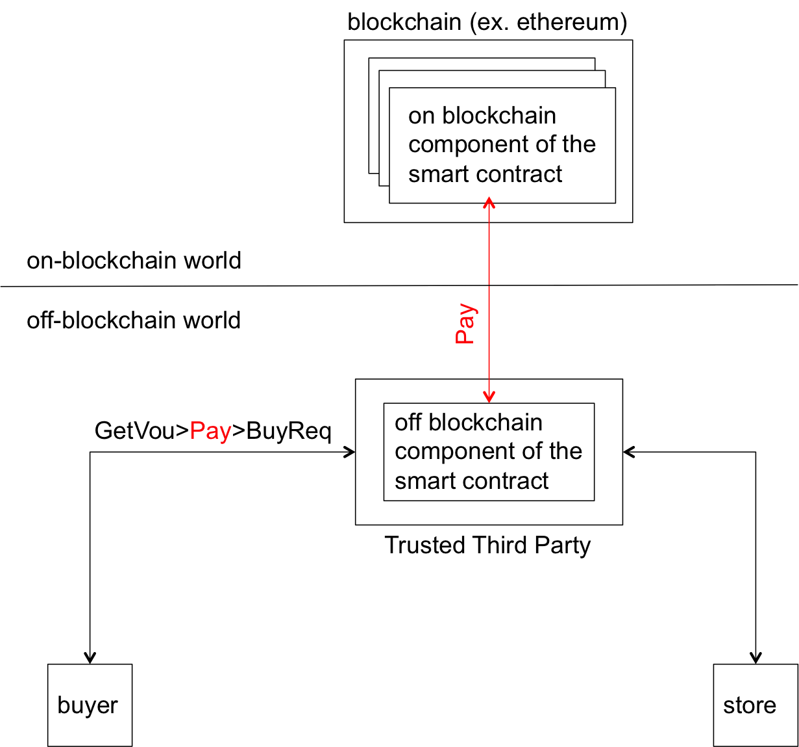

# TECOmate: 

**Tools for the Enforcement of Smart Contracts On-line with MAthematics and TEchnology**.
</br>


The word **tecomate** is pronunced [te.koˈma.te] in Spanish  and probably
[te.koˈmeit] in English is the name of tree that grows in Mexico 
and Central American countries. 
<p align="center">
  
</p>
</br>

We use **TECOmate** to name our Git repository that hosts the implementation
of an hybrid achitecture for the enforcement of smart contracts. 
Hybrid means that it is composed of on and off blockchain
components. 

**The main idea:** split the clauses of the smart
contract of interest into two sets and enforce them
separately:

* on--blockchain set: enforced by a smart contract running on-blockchain.
* off-blockchain set: enforced by a smart contract running off-blocchain.

The main arguments in support of hybrid architectures are
detailed in 
[On and Off-Blockchain Enforcement Of Smart Contracts](https://arxiv.org/pdf/1805.00626.pdf "position paper")). In summary the argument is that:

* the hybrid approach help in meeting some QoS requirements imposed on
smart contracts that neither on of off blockchain approaches
can meet individually. 

* application that involve several
smart contracts running independent on and off blockchain
components will become common practice in the near future. 

## Example of a smart contract
Let us use the following business contract agreed upon
between a buyer and a seller of personal data and 
written in English language.

```
1) The buyer has the right to place a buy request with the 
   store to buy an item.
2) The store has the obligation to respond with either confirmation 
   or rejection within 3 days of receiving the request.
   a) No response from the store within 3 days will be treated as a rejection.
3) The buyer has the obligation to either pay or cancel the request 
   within 7 days of receiving a confirmation.
   a) No response from the buyer within 7 days will be treated as a 
   cancellation.
4) The buyer has the right to get a voucher from the store, withing 5 
   days of submitting payment.
```
To convert the contract written in natural language into a
smart contract equivalent, it is convenient to  represented it 
schematically firstly, as shown in the figure.

<p align="center">
  
</p>

#### On and off blockchain enforcemement
Let us assume henceforth that the buter and the store have agreed to use a 
hybrid architecture where the operation *pay* will be enforced on blockchain 
and all other operations, off blockchain. An abstract view of the corresponding 
hybrid architecture is shown in the figure:

<p align="center">
  
</p>


## Hybrid architecture, tools and technologies

As shown in the figure, to implement such architeture we 
integrate several smart contract technologies and
tools.

<p align="center">
  
</p>

An elaborated discussion of the components and their
integration is presented in 
[Implementation of Smart Contracts Using Hybrid Architectures with On- and Off-Blockchain Components](https://arxiv.org/pdf/1808.00093.pdf "implementation paper")).
In this section, we will present only a summary of the
functionality of the components. 

* Contract Compliance Checker: 
  It is a Java application composed of several files, RESTful interfaces,
  and a database. At its core lies a FSM that grants and removes rights, 
  obligations and prohibitions to the contracting parties as the execution 
  of the contract progresses. To enforce a smart contract with the CCC, the 
  developer (i) writes the contract in the Drools language and stores it 
  in a .drl file (for example dataseller.drl), (ii) loads (copies) the drl 
  file into the configuration/drools/upload folder, and (iii) deploys and 
  instantiates the CCC as a web server (for example on a TTP node) that 
  waits for the arrival of events representing the contractual operation. 
  An event is a notification about the execution of a contractual operation 
  by a contractual partner. 
  For example when a buyer  executes the operation BuyRequest the event 
  BuyRequest is generated by the buyer’s application and sent to the CCC 
  for evaluation.


* epromela:


# Installation

The directions for installation of epromela are documented in
the [UserGuide_v1.2.pdf](./UserGuide_v1.2.pdf) file. The document
also includes examples that demonstrate its operation.

# Contributors

*  Massimo Strano developed the underlying Java components
   that integrate drools with the Contract Compliance
   Checker as part of his PhD dissertation (2010) at University 
   of Newcastle, UK.
*  Ionnis Sfyrakis from University of Newcastle, UK
   (Ioannis.Sfyrakis@newcastle.ac.uk) implemented
   the Web server interfaces to the Contract Compliance
   Checker as part of his Masters degree (2012) at 
   Newcastle and since them he has been actively
   contributing to the hybrid architecture. 
*  [Carlos Molina-Jimenez](https://www.cl.cam.ac.uk/~cm770/ "MyWebPage")
   from **The Department of
   Computer Science and Technology (Computer Laboratory),
   University of Cambridge**
   (Carlos.Molina@cl.cam.ac.uk) has been the main
   architect of the architecture.
   He has been maintaining, documenting and testing the tool.
   He is currently (2018) working in the
   [TESCON project](https://www.cl.cam.ac.uk/~cm770/tescon/tescon.html
   "TESCON webpage") (EPSRC grant Grant: RG90413 NRAG/536).


# Bug reporting and comments

Feel free to email
[carlos.molina + @ + cl.cam.a.uk](mailto:carlos.molina@cl.cam.ac.uk)
if you have comments, bugs to report or questions.


# Licence
The contraval tool is released under the Apache License,
Version 2.0 which is available from Apache’s web pages.
